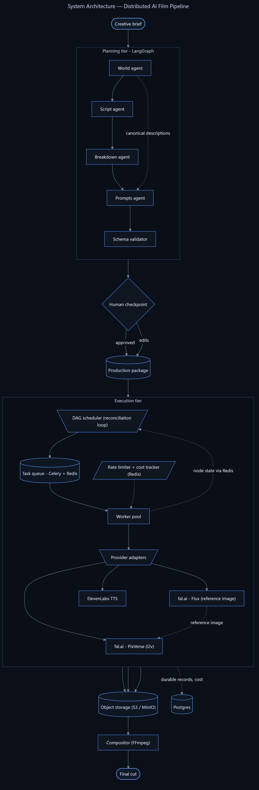

# Shorts AI

- A distributed video generation system that turns a short synopsis into a narrated animated film of 30, 60, or 90 seconds in length.
- A chain of LLM agents write the plan: the world and characters, a script, a shot list, the prompt for each shot, and an estimated cost.
- A human reviews, edits, and approves the plan in the browser before any money is spent.
- A scheduler hands each shot to a fleet of workers, which call image, video, and voice providers in parallel and store the results in S3.
- A compositor stitches the finished clips and narration into the final cut.

## Human Checkpoint

- The finished plan opens in a review screen to edit or approve: a form for the prompts, narration, and budget, or a raw JSON editor for everything else.
- Approving locks the plan and releases it to the scheduler. Edits are refused from then on so a run can't change underneath itself.

## Job Distribution

- Workers do the actual generating and report each shot's status and cost back to Redis. 
- Shots depend on each other. A clip needs its reference image first, so the plan is a dependency graph rather than a flat list.
- The scheduler rechecks the dependency graph once a second, looks for shots whose dependencies are all finished, and queues them.
- Before queueing a shot the scheduler checks the provider's rate limit and the project's remaining budget, so a run cannot overspend or get throttled.
- When every shot is done, the compositor is handed the timeline exactly once and renders the final video.

## Technologies

| Layer | Tech |
|---|---|
| Language | Python, TypeScript |
| REST APIs | FastAPI |
| Agent orchestration | LangGraph, Claude |
| Task queue | Celery, Redis |
| Shared state, rate limiting, budgets | Redis |
| Database | PostgreSQL |
| Object storage | S3 / MinIO |
| Media generation | fal.ai (Flux, PixVerse), ElevenLabs |
| Compositing | FFmpeg |
| Frontend | React, Vite, Tailwind |

## Running It

Mock mode runs the whole pipeline end to end with no paid API calls, which is how development and testing are done.

```bash
cp .env.example .env      # set MOCK=true
docker compose up --build
```

For a real render, set `MOCK=false` and supply funded provider keys.

## Scaling Workers

Workers are stateless and pull from the queue, so they can be scaled at any time without restarting the system. Each new worker starts claiming ready shots immediately.

**Start with multiple workers:**
```bash
docker compose up --build --scale worker=3
```

**Scale up while the system is running:**
```bash
docker compose up --scale worker=5 -d
```
## Architecture

